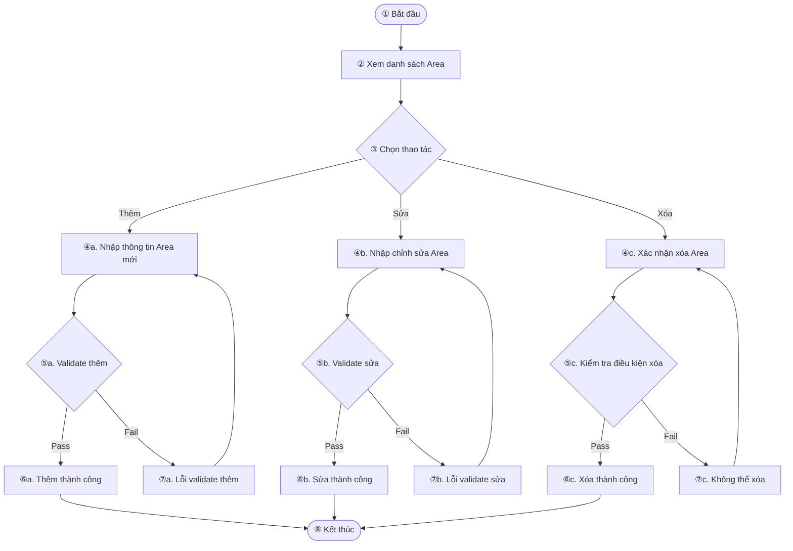

# TÀI LIỆU SRS - [Tên chức năng]

## 🗂 THÔNG TIN TÀI LIỆU

- **Module**: Module I (M)
- **Phân loại**: HẠN CHẾ
- **Mã số**: [Điền]
- **Lần sửa đổi**: [Điền]
- **Người viết/Cập nhật**: Thuy Le
- **Người xem xét**: Cat Nguyen

---

## 📌 THEO DÕI TÌNH TRẠNG SỬA ĐỔI

| Ngày cập nhật | Hạng mục | T/X/S | Tóm tắt nội dung | Phiên bản | Người viết |
|---------------|----------|-------|------------------|-----------|-------------|
|               |          |       |                  |           |             |

### 🔺 Ghi chú sửa đổi
- **T**: Thêm
- **X**: Xoá
- **S**: Sửa
- **TL**: Tài liệu

### 🎨 Màu sắc trạng thái
| Màu sắc | Trạng thái |
|--------|-------------|
| 🔴 Đỏ | BA đang chỉnh sửa |
| 🟤 Dâu đỏ/Nâu | Đã chỉnh sửa xong, chờ PM duyệt |
| 🔵 Xanh lam | PM duyệt 100%, chờ CO code |
| 🔷 Xanh đậm | PM duyệt, nhưng còn cần làm mịn nội dung |
| 🟠 Cam | Đã code xong, chờ TE test |
| 🟣 Tím | Đã test xong, chờ đưa lên môi trường thật |
| ⚫ Đen | Đã đưa lên Production và hoàn tất |

---

## 🎯 MỤC ĐÍCH
Mô tả ngắn gọn, dễ hiểu về mục đích của tính năng đang mô tả.

---

## 🧾 KHÁI NIỆM - VIẾT TẮT

| STT | Từ viết tắt | Mô tả |
|-----|-------------|--------|
|     |             |        |

---

## 🌐 PHIÊN BẢN WEB

### 1.1 Luồng màn hình
*(Vẽ sơ đồ chuyển qua lại giữa các màn hình bằng Mermaid hoặc đính kèm ảnh)*



---

### 1.2 [MH1] Chức năng 1 (F2)

#### 🎯 Mục đích
Mục đích sử dụng của màn hình

#### 🔗 Đường dẫn
- Đường dẫn truy cập: `...`
- Liên kết từ các chức năng: [liệt kê nếu có]

---

#### 1.2.1 Điều kiện ban đầu

- [ ] Nếu **chưa đăng nhập** → chuyển sang giao diện đăng nhập (→ link tới tài liệu Đăng nhập)
- [ ] Nếu **không đủ quyền** → chạy kịch bản cấp quyền (→ link tới Đề nghị cấp quyền)
- [ ] Nếu **chưa cấp quyền 1 số dịch vụ** → thực hiện cấp quyền dịch vụ (→ link nghiệp vụ chi tiết)

---

#### 1.2.2 Mockup
*(Đính kèm hình ảnh, chèn mã màn hình tương ứng)*

```markdown
- [MH001] Màn hình chọn thời gian
- [MH002] Màn hình xác nhận
```

---

#### 1.2.3 Mô tả chi tiết item

| # | Item | Tên | Type | Bắt buộc | Default | Trạng thái | Độ dài | Format | Mô tả |
|---|------|-----|------|----------|---------|------------|--------|--------|-------|
| 1 | Header | Tên tiếng Việt | Textbox | Có/Không | ... | Enable | 50 | YYYY/MM/DD | Validate bắt buộc |

---

#### 1.2.4 Nghiệp vụ chi tiết (nếu có)
- Mô tả nghiệp vụ hiển thị trong mockup nhưng validate phức tạp hơn

---

#### 1.2.5 Xử lý mạng (nếu có)

**Hiển thị:**
- Mạng yếu/mất → Giao diện có hiển thị cảnh báo? Có icon trạng thái mạng không?

**Tương tác:**
| Tình huống | Chiến lược xử lý |
|------------|------------------|
| Không có mạng | Modal cảnh báo, retry khi có mạng |
| Gửi request thất bại | Tự retry sau 5s |

| STT | Dữ liệu hiển thị | Hình ảnh | Mô tả |
|-----|-------------------|----------|-------|
| 1 | Lỗi mạng |  | Mô tả lỗi |

<span style="color:red">
<h4>1.2.6 Xử lý lỗi (nếu có)</h4>
<strong>Loại lỗi:</strong>
<ul>
  <li>[ ] Lỗi render giao diện</li>
  <li>[ ] Lỗi logic (client)</li>
  <li>[ ] Lỗi API (server)</li>
  <li>[ ] Lỗi MQTT</li>
</ul>
</span>
<span style="color:#1E90FF">Chữ màu xanh</span>

---

#### 1.2.6 Xử lý lỗi (nếu có)

**Loại lỗi:**
- [ ] Lỗi render giao diện
- [ ] Lỗi logic (client)
- [ ] Lỗi API (server)
- [ ] Lỗi MQTT

**Phản ứng:**
- Modal báo lỗi
- Gợi ý thử lại
- Ghi log tự động, retry ngầm

| STT | Dữ liệu hiển thị | Hình ảnh | Mô tả |
|-----|-------------------|----------|-------|
| 1 | Lỗi API |  | "Server Timeout" |

---

## 📱 2. Phiên bản Mobile
*(Tùy chọn thêm mục tương tự như Web)*

---

## 💻 3. Phiên bản Tablet
*(Tùy chọn thêm mục tương tự như Web)*

---

## 📎 GHI CHÚ KHÁC

> Mọi mô tả nên được review lại theo giai đoạn: BA → PM → CO → TE


| DR login | Đối tượng trả phí | Loại hợp đồng | Phương thức thanh toán Plan | Trạng thái hợp đồng | Hiển thị text         | Hiển thị bệnh viện phụ trách | Dải màu |
|----------|-------------------|----------------|------------------------------|----------------------|------------------------|------------------------------|----------|
| OFF      | -                 | -              | -                            | -                    | Không                 | Ẩn toàn bộ                  | Không dải cam |
| ON       | Pháp nhân         | -              | -                            | -                    | Có                    | Ẩn                           | Dải cam |
|          | Cá nhân           | 無制限 (Full)  | 0                            | Không                | Ẩn                    | Tất cả                      | Không dải cam |
|          |                   |                | 1                            | Có                   | Ẩn                    | Tất cả                      | Dải cam |
|          |                   |                | 2                            | Có (đến ngày cuối)   | Ẩn                    | Tất cả                      | Dải cam |
|          |                   |                | 3                            | Không                | Ẩn                    | Tất cả                      | Không dải cam |
|          |                   | ライト (Lite) | 0                            | Không                | Ẩn                    | Tất cả                      | Không dải cam |
|          |                   |                | 1                            | Có                   | Hiển thị danh sách đang mua + hẹn hủy | Danh sách phụ trách không nằm trong mua/hẹn hủy | Dải cam & Không dải cam |
|          |                   |                | 2 (Hẹn hủy)                  | Có                   | Hiển thị danh sách hẹn hủy | Như trên                    | Dải cam & Không dải cam |
|          |                   |                | 3 (Đã hủy ALL)               | Không                | Ẩn                    | Tất cả                      | Không dải cam |
|          |                   | TRIAL          | -                            | Có                   | Ẩn                    | Tất cả                      | Dải cam |
| 本社     | 無制限 (Full)     |                | 0                            | Không                | Ẩn                    | Tất cả                      | Không dải cam |
|          |                   |                | 1                            | Có                   | Ẩn                    | Tất cả                      | Dải cam |
|          |                   |                | 2                            | Có (đến ngày cuối)   | Ẩn                    | Tất cả                      | Dải cam |
|          |                   |                | 3                            | Không                | Ẩn                    | Tất cả                      | Không dải cam |
|          | ライト (Lite)     |                | 0                            | Không                | Ẩn                    | Tất cả                      | Không dải cam |
|          |                   |                | 1                            | Có                   | Hiển thị danh sách đang mua + hẹn hủy | Danh sách phụ trách không nằm trong mua/hẹn hủy | Dải cam & Không dải cam |
|          |                   |                | 2 (Hẹn hủy)                  | Có                   | Hiển thị danh sách hẹn hủy | Như trên                    | Dải cam & Không dải cam |
|          |                   |                | 3 (Đã hủy ALL)               | Không                | Ẩn                    | Tất cả                      | Không dải cam |
|          | TRIAL             | -              | Có                           |                      | Ẩn                    | Tất cả                      | Dải cam |
| Bệnh viện free | -           | -              | -                            | -                    | Ẩn                    | Tất cả                      | Không dải cam |


# 🧾 ME0004 - Matrix thanh toán DR login

## ✅ Bảng điều kiện hiển thị (Lặp lại thủ công các ô bị merge)

| DR login | Đối tượng trả phí | Loại hợp đồng | Plan | Trạng thái hợp đồng | Hiển thị text | Hiển thị bệnh viện phụ trách | Dải màu |
|----------|-------------------|----------------|------|----------------------|----------------|-------------------------------|----------|
| OFF      | -                 | -              | -    | -                    | Không           | Ẩn toàn bộ                   | Không dải cam |
| ON       | Pháp nhân         | -              | -    | -                    | Có              | Ẩn                             | Dải cam |
| ON       | Cá nhân           | 無制限 (Full)   | 0    | Không                | Ẩn              | Tất cả                        | Không dải cam |
| ON       | Cá nhân           | 無制限 (Full)   | 1    | Có                   | Ẩn              | Tất cả                        | Dải cam |
| ON       | Cá nhân           | 無制限 (Full)   | 2    | Có (đến ngày cuối)   | Ẩn              | Tất cả                        | Dải cam |
| ON       | Cá nhân           | 無制限 (Full)   | 3    | Không                | Ẩn              | Tất cả                        | Không dải cam |
| ON       | Cá nhân           | ライト (Lite)  | 0    | Không                | Ẩn              | Tất cả                        | Không dải cam |
| ON       | Cá nhân           | ライト (Lite)  | 1    | Có                   | Hiển thị danh sách đang mua + hẹn hủy | Danh sách phụ trách không nằm trong mua/hẹn hủy | Dải cam & Không dải cam |
| ON       | Cá nhân           | ライト (Lite)  | 2    | Có (Hẹn hủy)         | Hiển thị danh sách hẹn hủy | Như trên                    | Dải cam & Không dải cam |
| ON       | Cá nhân           | ライト (Lite)  | 3    | Không (Đã hủy ALL)   | Ẩn              | Tất cả                        | Không dải cam |
| ON       | Cá nhân           | TRIAL          | -    | Có                   | Ẩn              | Tất cả                        | Dải cam |
| ON       | 本社 (Công ty)    | 無制限 (Full)   | 0    | Không                | Ẩn              | Tất cả                        | Không dải cam |
| ON       | 本社 (Công ty)    | 無制限 (Full)   | 1    | Có                   | Ẩn              | Tất cả                        | Dải cam |
| ON       | 本社 (Công ty)    | 無制限 (Full)   | 2    | Có (đến ngày cuối)   | Ẩn              | Tất cả                        | Dải cam |
| ON       | 本社 (Công ty)    | 無制限 (Full)   | 3    | Không                | Ẩn              | Tất cả                        | Không dải cam |
| ON       | 本社 (Công ty)    | ライト (Lite)  | 0    | Không                | Ẩn              | Tất cả                        | Không dải cam |
| ON       | 本社 (Công ty)    | ライト (Lite)  | 1    | Có                   | Hiển thị danh sách đang mua + hẹn hủy | Danh sách phụ trách không nằm trong mua/hẹn hủy | Dải cam & Không dải cam |
| ON       | 本社 (Công ty)    | ライト (Lite)  | 2    | Có (Hẹn hủy)         | Hiển thị danh sách hẹn hủy | Như trên                    | Dải cam & Không dải cam |
| ON       | 本社 (Công ty)    | ライト (Lite)  | 3    | Không (Đã hủy ALL)   | Ẩn              | Tất cả                        | Không dải cam |
| ON       | 本社 (Công ty)    | TRIAL          | -    | Có                   | Ẩn              | Tất cả                        | Dải cam |
| ON       | Bệnh viện free     | -              | -    | -                    | Ẩn              | Tất cả                        | Không dải cam |

---

## 📎 Ghi chú

- [1] Hẹn hủy còn ngày sử dụng cuối
- [2] Đã huỷ 1 BV, còn >= 1 BV đang trả phí → status MR = 1
- [3] Đã huỷ toàn bộ → status MR = 3


# 🧾 ME0005 - Matrix điều kiện hiển thị MR/DR chức năng (Từ file "Quản lý MR/DR_機能グループ - Matrix")

## ✅ Matrix hiển thị trạng thái theo loại Plan, tình trạng thanh toán và liên kết với bệnh viện

| Loại Plan     | Hình thức thanh toán     | Trạng thái                      | Ghi chú                                                                 | Loại gói     | Màu hiển thị | Hiển thị text đỏ |
|---------------|--------------------------|----------------------------------|------------------------------------------------------------------------|--------------|---------------|------------------|
| Cá nhân       | Thanh toán cá nhân       | Status = 0 (Trial)              | Chưa đến thời hạn trả phí (trial)                                      | Fullplan     | Xanh         | ❌              |
| Cá nhân       | Thanh toán cá nhân       | Status = 0                      | Hết hạn trial, chưa mua                                                | Restricted   | Xám          | ❌              |
| Cá nhân       | Thanh toán qua card      | Status = 1 (Active)             | Đã mua                            | Fullplan     | Xanh         | ❌              |
| Cá nhân       | Thanh toán qua card      | Status = 2 (Hủy tạm)            | Cho sử dụng đến cuối tháng tiếp theo                                   | Fullplan     | Xanh         | ❌              |
| Cá nhân       | Thanh toán qua card      | Status = 3 (Hủy)                | Hết hạn                                                                | Restricted   | Xám          | ❌              |
| Cá nhân       | Thanh toán qua coupon    | Coupon còn hạn                 |                                                                        | Fullplan     | Xanh         | ❌              |
| Cá nhân       | Thanh toán qua coupon    | Coupon vô hạn                  |                                                                        | Fullplan     | Xanh         | ❌              |
| Cá nhân       | Thanh toán qua coupon    | Coupon hết hạn                 |                                                                        | Restricted   | Xám          | ❌              |
| Cá nhân       | Liteplan - card          | Status = 1                      | MR liên kết với BV login ME0005                                       | Liteplan     | Xanh         | ❌              |
| Cá nhân       | Liteplan - card          | Status = 1                      | MR đã xóa liên kết, hết ngày sử dụng cuối                             | Liteplan     | Xám          | ❌              |
| Cá nhân       | Liteplan - card          | Status = 1                      | MR đã xóa liên kết, còn ngày sử dụng cuối                             | Liteplan     | Xanh         | ❌              |
| Cá nhân       | Liteplan - card          | Status = 3 (Hủy tạm)            | MR vẫn liên kết với BV login ME0005, nhưng đã hủy tạm                 | Liteplan     | Xanh         | ❌              |
| Cá nhân       | Liteplan - card          | Status = 3 (Hủy tạm)            | MR không liên kết với BV login ME0005                                 | Liteplan     | Xanh         | ❌              |
| Cá nhân       | Liteplan - card          | Status = 3 (Hủy)                | MR đang liên kết với BV login ME0005                                  | Restricted   | Xám          | ❌              |
| Cá nhân       | Liteplan - card          | Status = 3 (Hủy)                | MR không liên kết với BV login ME0005                                 | Restricted   | Xám          | ❌              |
| Công ty       | Thanh toán công ty       | Status = 0                      | Chưa đến hạn trả phí                                                   | Fullplan     | Xanh         | ❌              |
| Công ty       | Thanh toán công ty       | Status = 0                      | Đã hết hạn, chưa mua                                                  | Restricted   | Xám          | ❌              |
| Công ty       | Thanh toán công ty       | Status = 1 (Active)             |                                                                        | Fullplan     | Xanh         | ❌              |
| Công ty       | Thanh toán công ty       | Status = 2 (Hủy tạm)            | Cho sử dụng đến cuối tháng tiếp theo                                   | Fullplan     | Xanh         | ❌              |
| Công ty       | Thanh toán công ty       | Status = 3 (Hủy)                |                                                                        | Restricted   | Xám          | ❌              |
| Công ty       | Liteplan - card          | Status = 1 (Active)             | MR liên kết với BV login ME0005                                       | Liteplan     | Xanh         | ❌              |
| Công ty       | Liteplan - card          | Status = 1                      | MR đã xóa liên kết, hết ngày sử dụng cuối                             | Liteplan     | Xám          | ❌              |
| Công ty       | Liteplan - card          | Status = 1                      | MR đã xóa liên kết, còn ngày sử dụng cuối                             | Liteplan     | Xanh         | ❌              |
| Công ty       | Liteplan - card          | Status = 3 (Hủy tạm)            | MR liên kết với BV login ME0005, nhưng đã hủy tạm                     | Liteplan     | Xanh         | ❌              |
| Công ty       | Liteplan - card          | Status = 3 (Hủy tạm)            | MR không liên kết với BV login ME0005                                 | Liteplan     | Xanh         | ❌              |
| Công ty       | Liteplan - card          | Status = 3 (Hủy)                | MR liên kết với BV login ME0005                                       | Restricted   | Xám          | ❌              |
| Công ty       | Liteplan - card          | Status = 3 (Hủy)                | MR không liên kết với BV login ME0005                                 | Restricted   | Xám          | ❌              |
| Pháp nhân     | Plan pháp nhân           | -                                |                                                                        | Fullplan     | Xanh         | ❌              |
| Bệnh viện free| -                        | -                                |                                                                        | Fullplan     | Xanh         | ❌              |
| Bệnh viện free| -                        | -                                |                                                                        | Liteplan     | Xanh         | ❌              |
| OFF tính phí  | -                        | -                                |                                                                        | Fullplan     | Xanh         | ❌              |

---

📎 Ghi chú:

- **ME0005** = màn hình chính để xác định trạng thái liên kết BV của MR
- **Status = 3 (Hủy)** nhưng còn ngày sử dụng cuối → vẫn cho dùng → Liteplan = Xanh
- **[1]** Không hiển thị trên ME0014 nếu đã hủy liên kết

